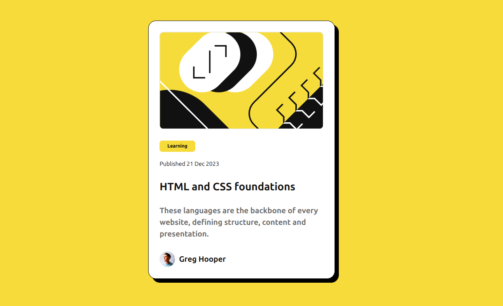

# Frontend Mentor - Blog preview card solution

This is a solution to the [Blog preview card challenge on Frontend Mentor](https://www.frontendmentor.io/challenges/blog-preview-card-ckPaj01IcS). Frontend Mentor challenges help you improve your coding skills by building realistic projects. 

## Table of contents

- [Overview](#overview)
  - [The challenge](#the-challenge)
  - [Screenshot](#screenshot)
  - [Links](#links)
- [My process](#my-process)
  - [Tools used](#tools-used)

## Overview

### The challenge

>  Users should be able to:
>
>  - See hover and focus states for all interactive elements on the page

### Screenshot

### Links

- Solution URL: [Add solution URL here](https://your-solution-url.com)
- Live Site URL: [CloudFlare Pages](https://blog-preview-card-bl1.pages.dev/)

## My process

1. Visually designed in Bootstrap Studio using a Mobile-first workflow
2. HTML and assets exported and edited in VS Code

### Tools used

- [Bootstrap](https://getbootstrap.com/) - CSS Framework
- [Bootstrap Studio](https://bootstrapstudio.io/) - Cross-Platform Design Software
- [GIMP](https://www.gimp.org/) - Free & Open Source Image Editor

